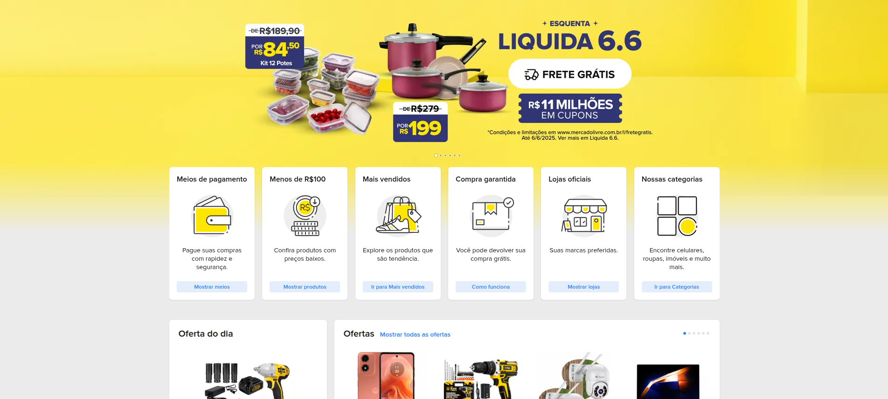
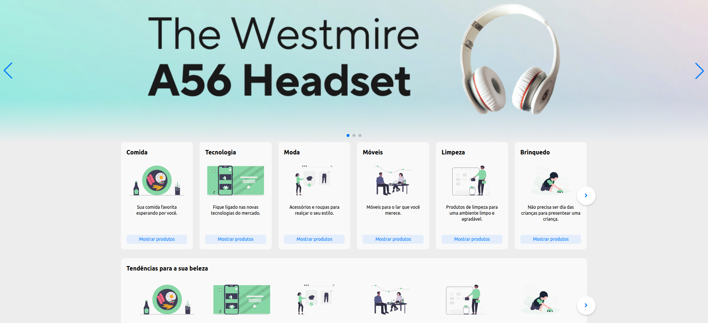

# Plataforma de E-commerce

Bem-vindo ao **Plataforma de E-commerce**, um projeto inspirado no Mercado Livre que oferece uma experiência de compras online dinâmica e amigável. Desenvolvido com tecnologias modernas e práticas rigorosas.

---

## Visão Geral do Projeto

A **Plataforma de E-commerce** é uma aplicação web que permite aos usuários explorar produtos, gerenciar carrinhos de compras, salvar favoritos e consultar históricos de compras. A arquitetura do sistema é escalável, manutenível e focada no usuário, replicando fluxos de um e-commerce do mundo real.

### Este projeto destaca minhas competências em:

- **Coleta de Requisitos**: Identificação e classificação de requisitos funcionais e não funcionais para atender às necessidades dos usuários.
- **Prototipação**: Uso do Mercado Livre como referência para agilizar o design de interface.
- **Testes**: Aplicação de testes de caixa preta e branca para garantir robustez e confiabilidade.
- **Desenvolvimento Full-Stack**: Integração de frontend, backend e banco de dados para uma aplicação coesa.

---

## Funcionalidades Principais

### Exploração de Produtos
- **Funcional**: Navegação por categorias organizadas.  
- **Funcional**: Pesquisa de produtos por palavras-chave para acesso rápido.  
- **Não Funcional**: Design responsivo para acessibilidade em diferentes dispositivos.

### Carrinho de Compras
- **Funcional**: Adição e remoção de produtos com atualização em tempo real do valor total.  
- **Não Funcional**: Otimizado para alto desempenho em operações de carrinho.

### Produtos Favoritos
- **Funcional**: Salvamento de produtos em uma lista de favoritos para acesso rápido.  
- **Não Funcional**: Persistência segura das preferências do usuário entre sessões.

### Histórico de Compras
- **Funcional**: Exibição detalhada do histórico de compras, incluindo data, forma de pagamento e itens adquiridos.  
- **Não Funcional**: Recuperação de dados otimizada para rapidez e precisão.

---

## Metodologia de Desenvolvimento

### Coleta de Requisitos
Realizei a coleta e classificação sistemática de requisitos para alinhar o projeto às necessidades do e-commerce:

- **Requisitos Funcionais**: Funcionalidades como busca, gerenciamento de carrinho e histórico de compras.
- **Requisitos Não Funcionais**: Desempenho (tempos de carregamento rápidos) e usabilidade (interface intuitiva).

## Prototipação
Para otimizar o desenvolvimento e garantir uma experiência de usuário refinada, utilizei a interface do Mercado Livre como referência, eliminando a necessidade de prototipagem extensiva. Essa abordagem permitiu focar na funcionalidade enquanto mantive uma interface familiar e intuitiva.

#### Referências Visuais:
- **Referência**: Interface do Mercado Livre  
   
- **Implementação**: Interface personalizada  
   

---

## Modelagem de Dados

O banco de dados foi projetado com o **Oracle Data Modeler** para garantir uma estrutura robusta e escalável:

- **Modelo Conceitual**  
    
  Define entidades de alto nível (ex.: Usuários, Produtos, Pedidos) e suas relações, alinhando-se à lógica de negócios.

- **Modelo Lógico**  
    
  Traduz o modelo conceitual em um esquema relacional otimizado para PostgreSQL, com tabelas normalizadas para minimizar redundâncias e garantir integridade de dados.

---

## Estratégia de Testes

Para assegurar a qualidade, implementei:

- **Testes de Caixa Preta**: Validei funcionalidades voltadas ao usuário (ex.: busca, atualizações de carrinho) sem conhecimento do código interno, garantindo conformidade com os requisitos funcionais.

- **Testes de Caixa Branca**: Utilizei conhecimento do código para testar APIs do backend e consultas ao banco de dados, abordando casos extremos e gargalos de desempenho.

---

## Tecnologias Utilizadas

### Frontend
- **Angular**: Framework para uma interface dinâmica e baseada em componentes.
- **Tailwind CSS**: Estilização rápida, responsiva e visualmente atraente.

### Backend
- **Express.js**: Framework leve para APIs REST no padrão MVC.

### Banco de Dados
- **PostgreSQL**: Sistema relacional robusto para armazenamento e consultas eficientes.

---

## Créditos

- **Logo**: [SVG Repo](https://www.svgrepo.com) para o logotipo da empresa fictícia.  
- **Banners e Carrosséis**: [Canva](https://www.canva.com) para gráficos promocionais.  
- **Imagens Animadas**: [unDraw](https://undraw.co) para visuais dinâmicos.  
- **Imagens de Produtos**: [Vecteezy](https://www.vecteezy.com) para imagens de alta qualidade.

---

Esta plataforma de e-commerce é um testemunho do meu crescimento como desenvolvedor, integrando aprendizados da graduação, experiências de estágio e cursos complementares. Ele demonstra minha capacidade de:

- Traduzir requisitos de negócios em soluções técnicas.
- Aplicar práticas padrão da indústria, como MVC, design responsivo e testes rigorosos.
- Entregar uma aplicação funcional e focada no usuário em um processo iterativo.

> Conforme o projeto evolui, continuarei a refinar funcionalidades, melhorar desempenho e incorporar feedback, mantendo-o como um portfólio dinâmico das minhas competências.
